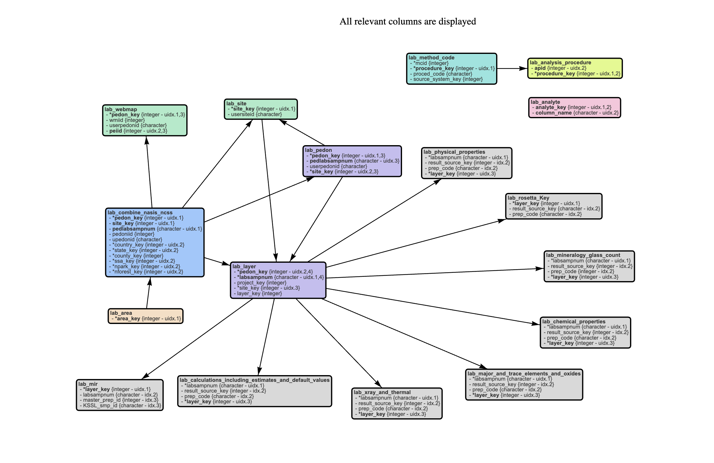

```{r}
#| label: setup
#| include: true
#| warning: false
#| message: false

library(tidyverse) # data processing
library(kableExtra) # pretty tables
library(bibtex) # reading in BibTex files to R

library(RSQLite) #read in the sqlite file that holds the sample data

## data files for level 0

# these files were manually pulled 26 Feb 2026 and committed to the repo
#...and need to be updated periodically
tableDesc.file <- 'NCSS Table Description.csv'
columnDesc.file <- 'NCSS Columns Description.csv'
relationships.file <- 'Relationships.csv'
uniqueID.file <- 'Unique Constraints.csv'

# this file was downloaded but not repo committed
sqlDownload <- 'temp/ncss_labdata.sqlite'

# Bibliography files
primaryCitation.file <- 'NCSS_SCD.bib'
methodsCitation.file <- 'NCSS_SCD_Methods.bib'

# read function; you will need to create this function after you have your data
#... rescue reviewed and before you finish your data harmonization.
readsource.file <- '../../02_DataHarmonization/readAuthorYYYY.R'
if(file.exists(readsource.file)){
  source(readsource.file)
}

#semantic files for level 1
#of_variable.file <- '../../02_DataHarmonization/of_variable.csv'
#is_type.file <- '../../02_DataHarmonization/is_type.csv'

```


# Data Summary

<!---- Fill in the full citation here, generally found on the journal page and link in the issue that you started on GitHub. Though this is at the top of the document, this should be one of the last things you do because a lot of this will be a direct copy-paste into the issue template. --->

> National Cooperative Soil Survey. National Cooperative Soil Survey Soil Characterization Database. http://ncsslabdatamart.sc.egov.usda.gov/. Accessed Thursday, February 26, 2026

For the discussion of this data rescue see the Github issue: https://github.com/ktoddbrown/SoilDRaH/issues/5.

<!--- After you read through the paper write a brief summary of what the study
measured and what the data was used for in. This should be <250 words.--->

The National Cooperative Soil Survey Soil Characterization Database is the USDA federal database for soil measurements, primarily taken at the KSSL (@NCSS_SCD2026).
They used a suite of classical soil measurements to characterize soil properties (@SSIR42) and have provided a complete manual for the use and interpretation (@SSIR45).
Further information for this data can be found at [https://catalog.data.gov/dataset/ncss-soil-characterization-database](https://catalog.data.gov/dataset/ncss-soil-characterization-database) (Last accessed 1 September 2026).

Since this is a large database which is served from the government website we duplicate the metadata here but do not include the primary date.
Please go to the website and download the "Tabular and Spatial" SQLite database, this script is designed to run on the unzip-ed download placed in the `temp` subfolder.

## Tables

There are 19 tables in this database that are all interconnected.



```{r}
#| label: reformatDescTable
#| output: asis
#| eval: true
tableDesc <- read_csv(tableDesc.file, show_col_types = FALSE)[1:19,]

temp.str <- paste0(sprintf('+ %s\n  - %s', tableDesc$table_name, tableDesc$table_description), collapse = '\n')

cat(temp.str)
```

Additional information about the [column names](NCSS Columns Description.csv) and [unique identifiers](Unique Constraints.csv) are also provided but not printed here.

## Fit for purpose: ISCN4

The purpose ISCN 2025 (aka ISCN4) is to create a data product aggregating data on geo-located soil organic carbon profiles.
With this data we will examine the assumption of steady state on field surveyed organic carbon.
We have closed contributions for this project and are working on analysis.

For this analysis we are interested in:

  * **Location**: latitude/longitude, associated datum, geo-spatial method, precision
    - The region information is given in the `lab_area`
    - The specific latitude/longitude is in `lab_site`
  * **Soil organic carbon stocks**: organic carbon fraction, bulk density, coarse fraction, soil organic carbon by area, soil organic carbon by volume
    - Organic carbon is given in `lab_chemical_properties`
    - Bulk density and coarse fraction are in the `lab_physical_properties`
  * **Layer depth**: Depth of surveyed soil layer
    - Layer depth is located in the `lab_layer` table.

```{r}
#| label: findCross
read_csv(file = 'Relationships.csv', show_col_types = FALSE) |>
  kable() |>
  kable_paper()
  
```

We also need `lab_preparation`, `lab_method_code`, `lab_analyte` and `lab_analysis_procedure` for methods.
The location and samples are cross linked using `lab_pedon`.

  
## Files

<!--- Include a brief explanation to all the files in the folder--->

These files are in the NCSS2023 data rescue.
Note here that we have downloaded some of the provided metadata and duplicated it in the repository.
This was done primarily for convenience so that the user only needed to download a single Sqlite file rather then multiple files across the website.

- [README_NCSS2023.qmd](README_NCSS2023.qmd)
  + This is the primary file that documents the transcriptions and decision made during data rescue.
- [NCSS_SCD.bib](NCSS_SCD.bib)
  + primary citation for the National Coorperative Soil Survey, Soil Characterization Database
- [NCSS_SCD_Methods.bib](NCSS_SCD_Methods.bib)
  + citations for the National Coorperative Soil Survey, Soil Characterization Database method references
- [NCSS Table Description.csv](NCSS Table Description.csv)
  + Table descriptions downloaded from web site, duplicated here for convenience
- [NCSS Columns Description.csv](NCSS Columns Description.csv)
  + Columns descriptions downloaded from web site, duplicated here for convenience
- [Relationships.csv](Relationships.csv)
  + Relationships between tables downloaded from web site, duplicated here for convenience
- [Unique Constraints.csv](Unique Constraints.csv)
  + Constraints across tables downloaded from web site, duplicated here for convenience
- [NCSSCharacterization_ER_20260226.png](NCSSCharacterization_ER_20260226.png)
  + Figure showing table relationships downloaded from web site, duplicated here for convenience
  
Old files that need to be removed

- NCSS_Annocations.csv : orginal metadata file before table downloads
- README_NCSS_OLD.qmd : old readme file

# Data Rescue working notes 
<!----
## Data Rescue Plan

+ Lead
  - [x] Read Web of Soils documentation here http://ncsslabdatamart.sc.egov.usda.gov/
  - [x] Download files http://ncsslabdatamart.sc.egov.usda.gov/ 
  - [x] Create a branch (since it's @ktoddbrown working here) of the primary repository https://github.com/ktoddbrown/SoilDRaH/tree/5-nrcs-ncss-web-of-soils_take2
  - [x] Create a copy of this template folder and rename it to AuthorYYYY
  - [x] Fill out Data summary section (except for the Files), the Data Rescue Plan (here!), and update the author section of the yml to reflect who is working on the rescue
  - [ ] Create a GitHub issue https://github.com/ktoddbrown/SoilDRaH/issues/5 
  - [ ] Add the reviewer to the author list in the yml
+ Do
  - [ ] identify relevant sql tables
  - [ ] script the table reads and check cross keys
  - [ ] Check that tables cross-reference
  - [x] Create a bib file with the citations
  - [ ] Create level0 read
+ Measure
  - [ ] compile or render this ReadMe with all chunks up through the Level 0 data rescue section with `eval: true`
  - [ ] push to repository and create a pull request to the main branch of the primary repository
  - [ ] address any revisions in your pull request review
  - [ ] celebrate!
---->

## Read database and constructed metadata


```{r}
#| label: readSQLiteDB

  myconnect <- RSQLite::dbConnect(drv = RSQLite::SQLite(), 
                                  dbname = sqlDownload)

actualTableNames <- dbListTables(myconnect)

table_names <- c("lab_analysis_procedure", "lab_analyte",
  "lab_chemical_properties", "lab_physical_properties",
  "lab_calculations_including_estimates_and_default_values",
  'lab_area', "lab_pedon", "lab_layer", "lab_site",
  "lab_preparation", "lab_method_code")

if(length(setdiff(table_names, actualTableNames)) != 0){
  stop('Looking for tables that are not there!')
}

lvl0.primary <- plyr::llply(
  setNames(as.list(table_names), table_names),
  .fun = function(xx){
    ans.ls <- list( RSQLite::dbReadTable(myconnect, xx))
    names(ans.ls) <- xx
    return(ans.ls)
  })

RSQLite::dbDisconnect(myconnect)


#constructed manually from documentation
lvl0.meta <- list(
  table = read_csv(file = tableDesc.file,
                       col_types = cols(.default = col_character())),
  columns = read_csv(file = columnDesc.file,
                       col_types = cols(.default = col_character())),
  relationships = read_csv(file = relationships.file,
                       col_types = cols(.default = col_character())),
  uniqueID = read_csv(file = uniqueID.file,
                       col_types = cols(.default = col_character()))
)

data.lvl0.ls <- list(
  data = lvl0.primary,
  meta = lvl0.meta
)
```


The code is also in `readsource.file` and returned with the `dataLevel = 'level0'` argument.
Below verifies that the data from the function matches what is coded above.

```{r}
#| label: checkReadFunction_lvl0
#| eval: false

if(file.exists(readsource.file)){
  datafunction.lvl0.ls <- readAuthorYYYY(dataDir = '.',
                                         dataLevel = 'level0')
  
  if(isTRUE(all.equal(datafunction.lvl0.ls, data.lvl0.ls))){
    print('Read function matches code here.')
  }else{
    print('There is a mismatch in the data objects between the code here and the read function.')
  }
}else{
  print('The read function does not exist.')
}
```

# Level 1 data - CURATION PROJECT

This data is identified as a data source for the ...
Broad classes of information that we are looking for include:

<!--- Include description of where the data is located in the source.--->
- Location: 
- Soil carbon stock: 
- Soil type: 
- Land use: 

Information from the methods and other sections are pulled into tables with line by line source citations.
This information can be values, units, methods, or other useful notes and is manually extracted from the transcriptions loaded into the level 0 data above.

The final format of the data frame here will include the following 

  + grouping ids
  + `of_variable`
  + `is_type`
  + `with_entry`
  + `from_source`

The `of_variable` being used here are:

 + citation
 
 <!--- include other variables being used, this should match vocabulary in the SoilDRaHVocabulary resources --->

```{r}
#| label: createLvl1
#| eval: false

#### Method-section only data ####
#Create a table for the data in the method-section that is not directly 
#...associated with any table. Often this is study level information.

studyMeta <- tribble(~of_variable, ~is_type, ~with_entry, ~from_source,
                   'region', 'value', 'Honaunau Forest on the southwestern slopes of Mauna Loa, island of Hawaii', paste('Method ln5:', paste(data.lvl0.ls$method[5], collapse = ' ')))

#### Table/Figure N ####
# Process the primary data from Table/Figure M by maintaining data groups and 
#...standardizing the variable name so that we can link this to the study 
#...metadata and data in the other tables when needed. Link in the methods 
#...and other information from the method-section as needed.

Table1Primary <- data.lvl0.ls$data$Table1$primary |>
  #Add a row id preserving row grouping -- not unique
  mutate(row_id = paste0('R', 1:n())) |>
  #Transform the table to long data by row group and column names.
  #...This allows us to then create the cross links between the tables.
  pivot_longer(cols = -row_id,
               names_to = 'column_name', values_to = 'with_entry',
               values_drop_na = TRUE) |> #drop missing values
  #Link the variable names to the column names using a switch statement
  mutate(of_variable = case_when(
           #Soil PH is given as an example below
           column_name == 'SOC' ~ 'soil_organic_carbon')) |>
  #Flag the source of this data as Table 1, this table is merged later with
  #...other data so this keeps track of where the data came from
  mutate(from_source = 'Table 1')

## Create the metadata for table one from the header information and cited methods
Table1Meta <- Table1Primary |>
  select(column_name, of_variable) |>
  unique() |>
  #Grab everything between the parentheses as units and attribute the source as the column names.
  mutate(unit = str_extract(column_name, pattern = '(?<=\\().*(?=\\))'),
         from_source = 'Table 1 column names.') |>
  #If there aren't units then drop the row
  filter(!is.na(unit)) |>
  #Don't keep the column name now that you have the units, cross link via the variable
  select(-column_name) |>
  #Stack into the table the methods for each variable that we can find
  bind_rows(
  tribble(~of_variable, ~method, ~from_source,
            'soil_organic_carbon', paste0(data.lvl0.ls$method[72:73], collapse = ' '), 'Methods ln72-73') ) |>
  #Stack onto the tables the controlled vocabulary used
  bind_rows(
    tribble(~of_variable, ~control_vocabulary, ~from_source,
            'soil_class', 'Histosol:USDA classification for histosol soil type|Andisols:USDA classification for andisol soil type', 'expert informed')
  ) |>
  # Push the dimensions of the variable into a single column. Making this a long table.
  pivot_longer(cols = c(unit, method, control_vocabulary),
               names_to = 'is_type',
               values_drop_na = TRUE,
               values_to = 'with_entry')

#### Create level 1 #####
## Pull everything together into by stacking the meta and primary data tables
data.lvl1.ls <- list(
  meta = bind_rows(studyMeta, Table1Meta),
  primary = bind_rows(Table1Primary)|>
    arrange(row_id, column_name,
            of_variable, is_type, with_entry, from_source)
  )

```

## Check for new variables

`of_variable` in the data files should be defined in the SoilDRaH Vocabulary files.

```{r}
#| label: check_of_variable
#| eval: false

#Read in the list of current 'of_variable' entries
SoilDRaH_variable_list <- read_csv(file =of_variable.file,
                                   show_col_types = FALSE)

#compare the variables in the level 1 tables to the SoilDRaH variables
new_variables <- lapply(data.lvl1.ls, function(xx){
  setdiff(unique(xx$of_variable), 
          unique(SoilDRaH_variable_list$of_variable))
}) |>
  unlist()

#Check that there are no new variables
if(length(new_variables) == 0){
  print('All of_variables are in the SoilDRaH variable list. No additions required')
}else{
  cat(paste('Please start a issue for new variables [',
               new_variables, ']', sep = '', collapse = '\n'))
}
```

## Check for is_type

`is_type` in the data files should be defined in the SoilDRaH Vocabulary files.

```{r}
#| label: check_is_type
#| eval: false

#read in the current types and what variable they are associated with
SoilDRaH_type_list <- read_csv(file = is_type.file,
                                   show_col_types = FALSE) |>
  #remove the project definition and only keep the variable and type
  select(of_variable, is_type) |>
  #variables are pushed together in the type defined table. Separate the
  #...entries here
  separate_longer_delim(cols = 'of_variable', delim = ',')

#Pull all the of_variable-is_type pairs from the source data
source_pairs <- tibble()

#If there are a large number of entries, consider replacing this for-loop.
#...However this avoids having to install the plyr or other libraries, and 
#...there are generally no more then 3-5 tables
for(dataTable in data.lvl1.ls){
  source_pairs <- dataTable |>
    select(of_variable, is_type) |> 
    unique() |>
    bind_rows(source_pairs)
}

undefined_data_type <- source_pairs |>
  #subset for variables that are not 'incomplete'
  semi_join(SoilDRaH_variable_list |>
              filter(project_status != 'incomplete'),
            by = join_by(of_variable)) |>
  #check for of_variable-is_type tuples that are not in the SoilDRaH type definitions
  anti_join(SoilDRaH_type_list,
            by = join_by(of_variable, is_type))

#Tell the user what you found.
if(nrow(undefined_data_type) == 0){
  print('All of_variables-is_types are in the SoilDRaH type list. No additions required')
}else{
  print(paste0('Please start a issue for new of_variable-is_type [', paste(paste(undefined_data_type$of_variable, undefined_data_type$is_type, sep = '-'), collapse = ','), ']'))
}
```

## Check function match

Check for an exact match with the read function.

```{r}
#| label: checkReadFunction_lvl1
#| eval: false

if(file.exists(readsource.file)){
  datafunction.lvl1.ls <- readAuthorYYYY(dataDir = '.',
                                         dataLevel = 'level1')
  
  if(isTRUE(all.equal(datafunction.lvl0.ls, data.lvl0.ls))){
    print('Read function output matches ReadMe code for level 1.')
  }else{
    print('There is a mismatch in the level 1 data objects between the code here and the read function.')
  }
}else{
  print('The read function does not exist.')
}

```


# References

<!---- This space will be filled with the citations when rendered. Leave this blank. ---->

