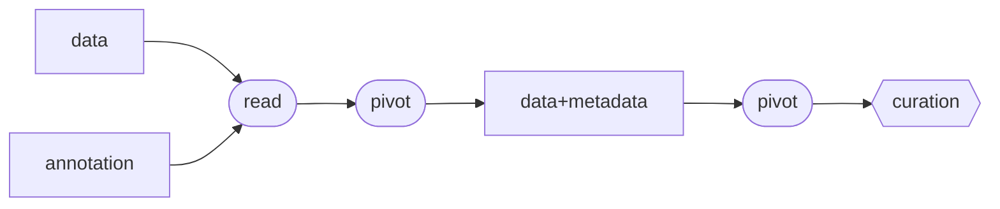

# Soil-DRaH

Soil Data Rescue and Harmonization:

```mermaid
flowchart LR
    A[data] & B[annotation]
    -->id1([read])
    -->id2([pivot])
    -->C[data+metadata]
    -->id3([pivot])
    -->id4{{curation}}
```

Helper scripts

  1) create annotation skeleton from tables 
  2) check annotation for compliance against yaml
